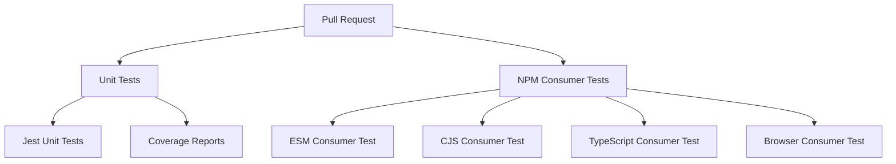

# GitHub Actions Workflows

Simple, clean workflow architecture with two separate workflows:

## 🏗️ Workflow Architecture

## 🧪 Unit Tests (`tests.yml`)

**Purpose**: Run standard Jest unit tests

- **Triggers**: Every pull request and push to main/develop
- **Tests**: `npm test` (Jest unit tests)
- **Coverage**: Uploads to Codecov
- **Node.js versions**: 18, 20, 22

## 📦 NPM Consumer Tests (`npm-consumer-tests.yml`)

**Purpose**: Test the dual ESM/CJS package architecture

- **Triggers**: Every pull request and push to main/develop  
- **Tests**: `npm run test:npm-consumers`
- **Validates**: All consumption patterns (ESM, CJS, TypeScript, Browser)
- **Node.js versions**: 18, 20, 22

## 🎯 Simple Architecture

Two workflows, two purposes:
1. **Unit Tests** - Internal functionality testing
2. **NPM Consumer Tests** - Package consumption testing

Both run on every PR, providing clean separation of concerns without complexity.