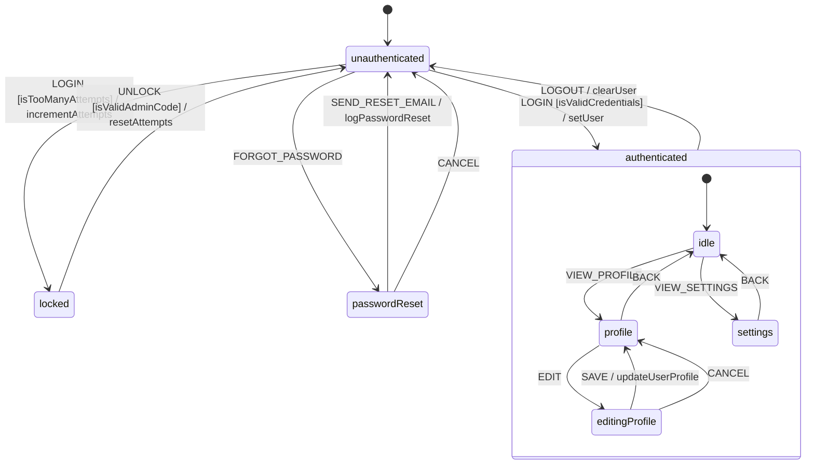
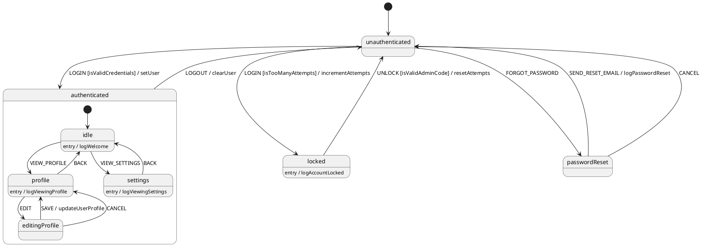

# HSMJS

A lightweight hierarchical state machine library for JavaScript with XState-like syntax. Perfect for managing complex application state, UI flows, and business logic.

[](https://www.npmjs.com/package/@datnguyen1215/hsmjs)
[](https://opensource.org/licenses/MIT)
[](https://github.com/your-username/hsmjs/actions)

## Features

- ✅ **CommonJs & ESM Support** - Use in Node.js or browser environments
- ✅ **Hierarchical States** - Nested states for complex logic
- ✅ **XState-like Syntax** - Familiar configuration format
- ✅ **Guards & Conditions** - Smart state transitions
- ✅ **Context Management** - Built-in state with `assign()`
- ✅ **Entry/Exit Actions** - Lifecycle hooks for states
- ✅ **Async Action Support** - Promise-based actions
- ✅ **JSDoc Type Support** - Full type definitions included
- ✅ **Zero Dependencies** - Lightweight bundle
- ✅ **Event Queuing** - Handles rapid event sequences
- ✅ **Wildcard Events** - Handle any unmatched event with `*`
- ✅ **Configuration Validation** - Built-in machine.validate() method
- ✅ **History & Rollback** - Undo state changes with built-in history tracking
- ✅ **State Visualization** - Generate Mermaid & PlantUML diagrams with machine.visualize()

## Installation Options

### NPM/Yarn

```bash
npm install @datnguyen1215/hsmjs
# or
yarn add @datnguyen1215/hsmjs
```

## Example

```javascript
import { createMachine, assign } from '@datnguyen1215/hsmjs'

// Authentication machine with nested states, guards, and context management
const authMachine = createMachine({
  id: 'auth',
  initial: 'unauthenticated',
  context: {
    user: null,
    loginAttempts: 0,
    maxAttempts: 3
  },
  states: {
    unauthenticated: {
      on: {
        LOGIN: [
          {
            target: 'authenticated',
            cond: 'isValidCredentials',
            actions: ['setUser']
          },
          {
            target: 'locked',
            cond: 'isTooManyAttempts',
            actions: ['incrementAttempts']
          },
          {
            actions: ['incrementAttempts', 'logInvalidCredentials']
          }
        ],
        FORGOT_PASSWORD: 'passwordReset'
      }
    },
    authenticated: {
      initial: 'idle', // Nested states start here
      states: {
        idle: {
          entry: ['logWelcome'],
          on: {
            VIEW_PROFILE: 'profile',
            VIEW_SETTINGS: 'settings'
          }
        },
        profile: {
          entry: ['logViewingProfile'],
          on: {
            BACK: 'idle',
            EDIT: 'editingProfile'
          }
        },
        editingProfile: {
          on: {
            SAVE: {
              target: 'profile',
              actions: ['updateUserProfile']
            },
            CANCEL: 'profile'
          }
        },
        settings: {
          entry: ['logViewingSettings'],
          on: { BACK: 'idle' }
        }
      },
      on: {
        LOGOUT: {
          target: 'unauthenticated',
          actions: ['clearUser']
        }
      }
    },
    passwordReset: {
      on: {
        SEND_RESET_EMAIL: {
          target: 'unauthenticated',
          actions: ['logPasswordReset']
        },
        CANCEL: 'unauthenticated'
      }
    },
    locked: {
      entry: ['logAccountLocked'],
      on: {
        UNLOCK: {
          target: 'unauthenticated',
          cond: 'isValidAdminCode',
          actions: ['resetAttempts']
        }
      }
    }
  }
}, {
  guards: {
    isValidCredentials: (ctx, event) =>
      event.username === 'admin' && event.password === 'pass',
    isTooManyAttempts: ctx => ctx.loginAttempts >= ctx.maxAttempts - 1,
    isValidAdminCode: (ctx, event) => event.adminCode === 'UNLOCK123'
  },
  actions: {
    setUser: assign({
      user: (ctx, event) => ({ username: event.username }),
      loginAttempts: 0
    }),
    incrementAttempts: assign({ loginAttempts: ctx => ctx.loginAttempts + 1 }),
    logInvalidCredentials: () => console.log('Invalid credentials'),
    resetAttempts: assign({ loginAttempts: 0 }),
    clearUser: assign({ user: null }),
    logPasswordReset: () => console.log('Password reset email sent'),
    logAccountLocked: () => console.log('Account locked due to too many failed attempts'),
    logWelcome: () => console.log('Welcome! You are in the idle state.'),
    logViewingProfile: () => console.log('Viewing profile...'),
    logViewingSettings: () => console.log('Viewing settings...'),
    updateUserProfile: assign((ctx, event) => ({
      user: { ...ctx.user, ...event.data }
    }))
  }
})

// Validate the machine configuration
const validation = authMachine.validate()
console.log(validation)
// { valid: true, errors: [], warnings: [] }

// Generate and display state diagram
const diagram = authMachine.visualize({ direction: 'TB' })
console.log(diagram)
```

### Generated Mermaid Diagram



### PlantUML Diagrams

PlantUML offers unique advantages for state machines with complex lifecycle actions. When your states have multiple entry/exit actions, PlantUML displays these actions as inline annotations within state boxes, making them more readable than traditional diagram formats. Choose PlantUML over Mermaid when you need clear visualization of state lifecycle behaviors.

Generate PlantUML diagrams that show entry/exit actions inside state boxes:

```javascript
const plantUmlDiagram = authMachine.visualize({ type: 'plantuml' })
console.log(plantUmlDiagram)
```



PlantUML diagrams display entry/exit actions as inline annotations within state boxes, making them more readable when states have multiple lifecycle actions.

### Usage Examples

```javascript
// Initial state
console.log(authMachine.state) // 'unauthenticated'
console.log(authMachine.context) // { user: null, loginAttempts: 0, maxAttempts: 3 }

// Failed login attempt
await authMachine.send('LOGIN', { username: 'user', password: 'wrong' })
// State: 'unauthenticated', loginAttempts: 1

// Too many failed attempts (after 3 tries)
// State transitions: unauthenticated -> locked

// Successful login
await authMachine.send('LOGIN', { username: 'admin', password: 'pass' })
// State transitions: unauthenticated -> authenticated.idle
// Context: { user: { username: 'admin' }, loginAttempts: 0, maxAttempts: 3 }

// Navigate within authenticated state
await authMachine.send('VIEW_PROFILE')
// State transitions: authenticated.idle -> authenticated.profile

await authMachine.send('EDIT')
// State transitions: authenticated.profile -> authenticated.editingProfile

await authMachine.send('SAVE', { data: { email: 'admin@example.com' } })
// State transitions: authenticated.editingProfile -> authenticated.profile
// Context: user updated with email

await authMachine.send('BACK')
// State transitions: authenticated.profile -> authenticated.idle

// Logout
await authMachine.send('LOGOUT')
// State transitions: authenticated.idle -> unauthenticated
// Context: { user: null, loginAttempts: 0, maxAttempts: 3 }
```

## Framework Integration

### React Hook Example

```javascript
import { useReducer, useEffect } from 'react'
import { createMachine, assign } from '@datnguyen1215/hsmjs'

const useMachine = machine => {
  const [, forceUpdate] = useReducer(x => x + 1, 0)

  useEffect(() => {
    const unsubscribe = machine.subscribe(() => forceUpdate())
    return unsubscribe
  }, [machine])

  return [machine.state, machine.context, machine.send.bind(machine)]
}

// In component
const [state, context, send] = useMachine(toggleMachine)
```

### Svelte Store Example

```javascript
import { writable } from 'svelte/store'
import { createMachine } from '@datnguyen1215/hsmjs'

const createMachineStore = machine => {
  const { subscribe, set } = writable({
    state: machine.state,
    context: machine.context
  })

  machine.subscribe(() => {
    set({ state: machine.state, context: machine.context })
  })

  return {
    subscribe,
    send: machine.send.bind(machine)
  }
}
```

## Documentation

| Topic                                                  | Description                                 |
| ------------------------------------------------------ | ------------------------------------------- |
| [Getting Started](docs/getting-started.md)             | Installation, basic concepts, first machine |
| [API Reference](docs/api-reference.md)                 | Complete API documentation                  |
| [Advanced Features](docs/advanced-features.md)         | Guards, nested states, async actions        |
| [Framework Integration](docs/framework-integration.md) | React, Svelte, Vue examples                 |
| [Examples & Patterns](docs/examples.md)                | Real-world use cases                        |

## Browser Support

- Chrome 63+ | Firefox 67+ | Safari 13+ | Edge 79+ | Node.js 14+

## License

MIT © Dat Nguyen

