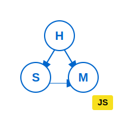

# HSMJS



Lightweight hierarchical state machine for JavaScript with XState-like syntax.

[](https://www.npmjs.com/package/@datnguyen1215/hsmjs)
[](https://opensource.org/licenses/MIT)
[](https://github.com/datnguyen1215/hsmjs)
[](https://github.com/datnguyen1215/hsmjs/issues)

## Features

✅ **Zero Dependencies**
✅ **XState-like Syntax**
✅ **Nested States**
✅ **Async Actions**
✅ **TypeScript/JSDoc**
✅ **History & Undo**
✅ **State Visualization**

## Installation

```bash
npm install @datnguyen1215/hsmjs
```

## Quick Start

```javascript
import { createMachine, assign } from '@datnguyen1215/hsmjs';

const toggleMachine = createMachine({
  id: 'toggle',
  initial: 'inactive',
  context: { count: 0 },
  states: {
    inactive: {
      on: {
        TOGGLE: {
          target: 'active',
          actions: [assign({ count: ({ context }) => context.count + 1 })]
        }
      }
    },
    active: {
      entry: [() => console.log('Activated!')],
      on: { TOGGLE: 'inactive' }
    }
  }
});

// Use the machine
await toggleMachine.send('TOGGLE');  // inactive -> active, count: 1
console.log(toggleMachine.state);     // 'active'
console.log(toggleMachine.context);   // { count: 1 }
```


## Documentation

### Quick Links
- [**Quick Start**](docs/getting-started.md) - Get started in 5 minutes
- [**Syntax Cheatsheet**](docs/syntax-cheatsheet.md) - All syntax on one page
- [**API Quick Reference**](docs/api-quick-reference.md) - Most used methods
- [**Migration from XState**](docs/migration-xstate.md) - Switching from XState

### Feature Guides
- [Context & assign()](docs/features/context-management.md)
- [Actions](docs/features/actions.md)
- [Guards](docs/features/guards.md)
- [Events](docs/features/events.md)
- [Nested States](docs/features/nested-states.md)
- [Async Patterns](docs/features/async-patterns.md)
- [History & Undo](docs/features/history-undo.md)
- [Visualization](docs/features/visualization.md)
- [Validation](docs/features/validation.md)
- [Subscriptions](docs/features/subscriptions.md)

### More Resources
- [Framework Integration](docs/framework-integration.md) - React, Svelte, Vue
- [Examples](docs/examples.md) - Real-world patterns
- [Full API Reference](docs/api-reference.md) - Complete documentation

## License

MIT

