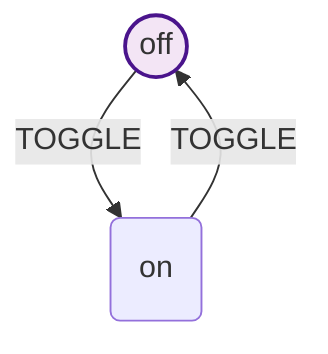
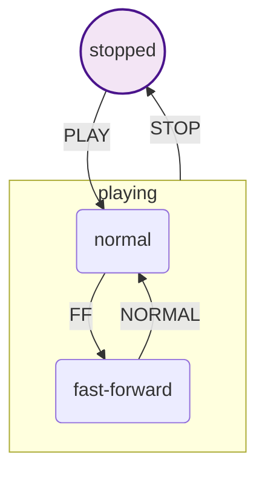

# API Reference

> **New in v1.2.0:** Built-in state machine visualization with Mermaid diagram generation and browser preview capabilities.

## Importing

```javascript
// ES6 Modules
import { createMachine } from '@datnguyen1215/hsmjs';

// CommonJS
const { createMachine } = require('@datnguyen1215/hsmjs');
```

## Table of Contents

- [Machine Creation](#machine-creation)
- [State Definition](#state-definition)
- [Hierarchical States](#hierarchical-states)
- [State Lifecycle](#state-lifecycle)
- [Transitions](#transitions)
- [Transition Modifiers](#transition-modifiers)
- [Machine Instance](#machine-instance)
- [Global Handlers](#global-handlers)
- [Context Management](#context-management)
- [Event Subscriptions](#event-subscriptions)
- [**Visualization (New!)**](#visualization) ⭐

## Machine Creation

### `createMachine(name: string): Machine`

Creates a new state machine definition.

**Parameters:**
- `name` - A descriptive name for the machine (used for debugging)

**Returns:** A machine object with methods for state definition and configuration

**Example:**
```javascript
import { createMachine } from '@datnguyen1215/hsmjs';

const machine = createMachine('app');
```

## State Definition

### `machine.state(id: string): State`

Creates a new state in the machine. States must have unique IDs within their parent scope.

**Parameters:**
- `id` - Unique identifier for the state

**Returns:** A `State` instance

**Throws:** Error if state ID already exists

**Example:**
```javascript
const idle = machine.state('idle');
const loading = machine.state('loading');
const error = machine.state('error');
```

### `machine.initial(stateOrId: State | string): Machine`

Sets the initial state of the machine. Must be called before starting the machine.

**Parameters:**
- `stateOrId` - Either a State instance or a state ID string

**Returns:** The Machine instance (for chaining)

**Throws:** Error if state not found or no initial state set

**Example:**
```javascript
// Using state reference
machine.initial(idle);

// Using state ID
machine.initial('idle');
```

## Hierarchical States

### `state.state(id: string): State`

Creates a nested child state. Child states inherit behavior from their parents.

**Parameters:**
- `id` - Unique identifier for the child state (within parent scope)

**Returns:** A `State` instance

**Example:**
```javascript
const auth = machine.state('auth');
const login = auth.state('login');      // Creates 'auth.login'
const register = auth.state('register'); // Creates 'auth.register'
const verify = auth.state('verify');     // Creates 'auth.verify'
```

### `state.initial(stateOrId: State | string): State`

Sets the default child state. When entering a parent state, the machine automatically enters its initial child state.

**Parameters:**
- `stateOrId` - Either a State instance or a state ID string

**Returns:** The State instance (for chaining)

**Example:**
```javascript
auth.initial('login'); // When entering 'auth', also enter 'auth.login'
```

### Relative State Navigation

Use relative path notation to reference states relative to the current state:

```javascript
// Go to parent state
loginForm.on('CANCEL', '^');

// Go to grandparent state (two levels up)
deepChild.on('HOME', '^^');

// Go to great-grandparent (three levels up)
deeplyNested.on('TOP', '^^^');

// Go to sibling (parent's child)
login.on('REGISTER', '^.register');

// Go to cousin (grandparent's descendant)
deepChild.on('COUSIN', '^^.otherParent.cousin');

// Note: ^.^ is NOT valid syntax - use ^^ instead
```

**Path Resolution:**
- `^` - Navigate to parent state
- `^^` - Navigate to grandparent (NOT `^.^`)
- `^^^` - Navigate to great-grandparent
- `^.sibling` - Navigate to parent, then to its child named 'sibling'
- `^^.uncle.cousin` - Navigate to grandparent, then through its descendants

## State Lifecycle

### `state.enter(action: Function): State`

Adds an action to execute when entering the state. Multiple entry actions can be added and will execute in order.

**Parameters:**
- `action` - Function with signature `(context, event) => void`

**Returns:** The State instance (for chaining)

**Example:**
```javascript
loading
  .enter((ctx) => {
    ctx.startTime = Date.now();
  })
  .enter((ctx, event) => {
    console.log(`Loading ${event.resource}`);
  });
```

### `state.exit(action: Function): State`

Adds an action to execute when exiting the state. Multiple exit actions can be added and will execute in order.

**Parameters:**
- `action` - Function with signature `(context, event) => void`

**Returns:** The State instance (for chaining)

**Example:**
```javascript
loading
  .exit((ctx) => {
    ctx.loadTime = Date.now() - ctx.startTime;
  })
  .exit((ctx) => {
    console.log(`Loading took ${ctx.loadTime}ms`);
  });
```

## Transitions

### `state.on(event: string, target: string | Function): Transition`

Defines a transition from this state to another when an event occurs.

**Parameters:**
- `event` - Event name that triggers the transition
- `target` - Target state ID or function returning state ID

**Returns:** A `Transition` instance for chaining modifiers

**Target Types:**
- **State ID:** `on('EVENT', 'targetId')` - Simple string reference
- **Dynamic target:** `on('EVENT', (ctx, event) => ctx.premium ? 'premium' : 'basic')` - Function returning string
- **Parent reference:** `on('EVENT', '^')` or `on('EVENT', '^^')` - Relative navigation

**Example:**
```javascript
// State ID
idle.on('START', 'loading');

// Dynamic target based on context
idle.on('START', (ctx) => ctx.hasCache ? 'ready' : 'loading');

// Parent state
form.on('CANCEL', '^');
```

## Transition Modifiers

Transitions can be modified with conditions and actions. All modifiers return the Transition instance for chaining.

### `.if(guard: (ctx, event) => boolean): Transition`

Adds a guard condition. The transition only occurs if the guard returns true.

**Parameters:**
- `guard` - Predicate function that receives context and event

**Example:**
```javascript
form
  .on('SUBMIT', 'processing')
  .if((ctx) => ctx.form.isValid)
  .if((ctx) => ctx.user.isAuthenticated); // Multiple guards (AND)
```

### `.after(ms: number, target: State | string): void`

Automatically transitions to another state after a specified time.

**Parameters:**
- `ms` - Delay in milliseconds
- `target` - Target state (can be State instance or state ID)

**Example:**
```javascript
// Traffic light timing
red.after(3000, 'green');
green.after(3000, 'yellow');
yellow.after(1000, 'red');

// Loading timeout
loading.after(5000, 'timeout');
```

### `.do(action: (ctx, event) => any): Transition`

Adds a synchronous action that blocks the transition until complete. Multiple actions execute in order.

**Parameters:**
- `action` - Function that receives context and event

**Returns:** Action results are collected and returned from `send()`

**Example:**
```javascript
idle
  .on('SUBMIT', 'processing')
  .do((ctx, event) => {
    ctx.timestamp = Date.now();
    ctx.data = event.payload;
  })
  .do((ctx) => {
    localStorage.setItem('draft', JSON.stringify(ctx.data));
    return { saved: true };
  });
```

### Async Actions with `.do()`

The `.do()` method supports both synchronous and asynchronous actions. When using async functions, the transition waits for the promise to resolve.

**Example:**
```javascript
form
  .on('SUBMIT', 'success')
  .do(async (ctx, event) => {
    const response = await api.submit(event.data);
    ctx.submissionId = response.id;
    return { id: response.id, status: response.status };
  })
  .do(async (ctx) => {
    await api.notifyWebhook(ctx.submissionId);
  });
```

### `.fire(action: Function): Transition`

Adds a fire-and-forget action that runs without blocking the transition. Errors are caught and logged but don't affect the transition.

**Parameters:**
- `action` - Function (can be async) that receives context and event

**Example:**
```javascript
purchase
  .on('COMPLETE', 'thankyou')
  .do((ctx, event) => {
    ctx.orderId = event.orderId;
  })
  .fire(async (ctx) => {
    // Analytics (don't block transition)
    await analytics.track('purchase_complete', {
      orderId: ctx.orderId,
      amount: ctx.total
    });
  })
  .fire(async (ctx) => {
    // Send email (don't block transition)
    await email.sendReceipt(ctx.user.email, ctx.orderId);
  });
```

## Machine Instance

### `machine.start(initialContext?: object): Instance`

Creates a running instance of the machine with optional initial context.

**Parameters:**
- `initialContext` - Initial context object (default: `{}`)

**Returns:** An `Instance` object

**Example:**
```javascript
const instance = machine.start({
  user: null,
  cart: [],
  preferences: {
    theme: 'dark',
    notifications: true
  }
});
```

### `instance.send(event: string, payload?: any): Promise<object>`

Sends an event to the machine, potentially triggering a transition.

**Parameters:**
- `event` - Event name
- `payload` - Optional event data (merged into event object)

**Returns:** Promise resolving to collected action results

**Behavior:**
- Always returns a promise (even for sync-only transitions)
- Waits for all `.do()` actions (both sync and async)
- Does not wait for `.fire()` actions
- Collects and merges return values from actions
- Throws if any blocking action throws

**Example:**
```javascript
// Simple event
await instance.send('CLICK');

// Event with payload
await instance.send('LOGIN', {
  email: 'user@example.com',
  password: 'secret'
});

// Capture action results
const results = await instance.send('SAVE');
console.log(results);
// {
//   valid: true,
//   id: 123,
//   status: 'saved'
// }

// Error handling
try {
  await instance.send('SUBMIT');
} catch (error) {
  console.error(`Action failed:`, error.message);
}
```

### `instance.current: string`

Gets the current state ID (dot-notation for nested states).

**Example:**
```javascript
console.log(instance.current); // 'idle'

await instance.send('LOGIN');
console.log(instance.current); // 'auth.login'
```

### `instance.context: object`

Gets the current context object. This is the same object passed to actions, so mutations are reflected immediately.

**Example:**
```javascript
console.log(instance.context.user); // null

await instance.send('LOGIN', { userId: 123 });
console.log(instance.context.user); // { id: 123, name: 'John' }
```

### `instance.subscribe(listener: Function): Function`

Subscribes to state change notifications.

**Parameters:**
- `listener` - Function called with transition details

**Returns:** Unsubscribe function

**Listener receives:**
```typescript
{
  from: string,  // Previous state ID
  to: string,    // New state ID
  event: string  // Event that triggered transition
}
```

**Example:**
```javascript
const unsubscribe = instance.subscribe(({ from, to, event }) => {
  console.log(`[${event}] ${from} -> ${to}`);
  updateUI(to);
});

// Later: stop listening
unsubscribe();
```

## Global Handlers

### `machine.on(event: string, target): Transition`

Defines a global transition that works from any state. Useful for logout, error handling, or emergency stops.

**Parameters:**
- `event` - Event name
- `target` - Target state (same options as state.on())

**Returns:** Transition instance for chaining

**Example:**
```javascript
// Global logout
machine
  .on('LOGOUT', 'auth.login')
  .do((ctx) => {
    ctx.user = null;
    ctx.token = null;
    localStorage.clear();
  })
  .fire(() => {
    analytics.track('user_logout');
  });

// Global error handler
machine
  .on('FATAL_ERROR', 'error')
  .do((ctx, event) => {
    ctx.error = event.error;
    ctx.errorTime = Date.now();
  });

// Emergency stop from any state
machine.on('EMERGENCY_STOP', 'stopped');
```

## Context Management

Context is the data associated with a machine instance. It's passed to all guards, actions, and listeners.

### Initial Context

```javascript
const instance = machine.start({
  user: null,
  items: [],
  settings: { theme: 'light' }
});
```

### Updating Context

Context is typically updated in actions:

```javascript
state
  .on('UPDATE', 'next')
  .do((ctx, event) => {
    // Direct mutation
    ctx.user = event.user;

    // Adding properties
    ctx.lastUpdate = Date.now();

    // Updating nested objects
    ctx.settings.theme = event.theme;
  });
```

### Context Isolation

Each machine instance has its own isolated context:

```javascript
const instance1 = machine.start({ count: 0 });
const instance2 = machine.start({ count: 0 });

await instance1.send('INCREMENT'); // instance1.context.count = 1
// instance2.context.count still 0
```

## Event Subscriptions

### Subscription Patterns

```javascript
// Log all transitions
instance.subscribe(({ from, to, event }) => {
  console.log(`[${new Date().toISOString()}] ${event}: ${from} -> ${to}`);
});

// Update UI based on state
instance.subscribe(({ to }) => {
  document.body.className = `state-${to.replace(/\./g, '-')}`;
});

// Track analytics
instance.subscribe(({ from, to, event }) => {
  analytics.track('state_change', { from, to, event });
});

// Sync with external store
instance.subscribe(({ to }) => {
  store.dispatch({ type: 'HSM_STATE_CHANGE', state: to });
});
```

### Multiple Subscribers

```javascript
const unsubscribe1 = instance.subscribe(updateUI);
const unsubscribe2 = instance.subscribe(logTransition);
const unsubscribe3 = instance.subscribe(syncStore);

// Remove specific subscriber
unsubscribe2();

// Remove all (cleanup)
[unsubscribe1, unsubscribe3].forEach(fn => fn());
```

## Error Handling

### Action Errors

Errors in blocking actions (`.do()`) prevent the transition:

```javascript
state
  .on('SAVE', 'saved')
  .do(async (ctx) => {
    throw new Error('Network error');
  });

try {
  await instance.send('SAVE');
} catch (error) {
  console.log(instance.current); // Still in original state
  console.error(error.message); // 'Network error'
}
```

### Fire Action Errors

Errors in fire actions don't affect transitions but are logged:

```javascript
state
  .on('COMPLETE', 'done')
  .fire(async () => {
    throw new Error('Analytics failed');
  });

await instance.send('COMPLETE'); // Succeeds
// Error logged to console: "Fire action error: Analytics failed"
```

### Guard Errors

Errors in guards are treated as `false`:

```javascript
state
  .on('SUBMIT', 'next')
  .if((ctx) => {
    throw new Error('Guard error');
  });

await instance.send('SUBMIT'); // No transition occurs
```

### Lifecycle Errors

Errors in enter/exit actions are logged but don't prevent transitions:

```javascript
state
  .enter(() => {
    throw new Error('Entry error');
  });

await instance.send('GO_TO_STATE'); // Transition succeeds
```

## Visualization

> **New Feature:** Generate Mermaid diagrams of your state machines for documentation and debugging.

### Machine Visualization

#### `machine.visualizer().visualize(): string`

Generates a Mermaid diagram string representing the complete state machine structure.

**Returns:** `string` - Mermaid diagram syntax

**Features:**
- Hierarchical states shown as subgraphs
- Initial state highlighted with special styling
- All transitions with event labels
- Sanitized state IDs for Mermaid compatibility

**Example:**
```javascript
const machine = createMachine('toggle')

const off = machine.state('off')
const on = machine.state('on')

off.on('TOGGLE', on)
on.on('TOGGLE', off)
machine.initial(off)

const visualizer = machine.visualizer()
const diagram = visualizer.visualize()
console.log(diagram)
```

**Output:**


#### `machine.visualizer(): VisualizerInterface`

Returns a visualizer object for generating Mermaid diagrams.

**Returns:** Object with method:
- `visualize(): string` - Generates Mermaid diagram text

**Example:**
```javascript
const viz = machine.visualizer()

// Generate Mermaid diagram text
const diagram = viz.visualize()
console.log(diagram)

// Use the diagram with external tools or services
document.getElementById('diagram').textContent = diagram
```

### Instance Visualization

#### `instance.visualizer().visualize(): string`

Generates a Mermaid diagram with current state highlighting for running instances.

**Returns:** `string` - Mermaid diagram with current state styling

**Features:**
- All machine structure visualization features
- Current state highlighted in blue
- Combines initial state and current state styling

**Example:**
```javascript
const instance = machine.start()
await instance.send('TOGGLE')

const visualizer = instance.visualizer()
const diagram = visualizer.visualize()
// Shows 'on' state with blue highlighting
```

**Current State Styling:**
```css
class on current
classDef current fill:#e1f5fe,stroke:#01579b,stroke-width:3px
```

#### `instance.visualizer(): VisualizerInterface`

Returns a visualizer object for the instance with current state context.

**Returns:** Object with method:
- `visualize(): string` - Generates Mermaid diagram with current state highlighting

**Example:**
```javascript
const instance = machine.start()
await instance.send('PLAY')

// Generate diagram with current state highlighted
const diagram = instance.visualizer().visualize()
console.log(diagram) // Shows current state with special styling
```

### Hierarchical State Visualization

Complex nested states are automatically organized using Mermaid subgraphs:

**Example:**
```javascript
const machine = createMachine('media-player')

const stopped = machine.state('stopped')
const playing = machine.state('playing')

// Nested states
const normal = playing.state('normal')
const fastForward = playing.state('fast-forward')

stopped.on('PLAY', normal)
normal.on('FF', fastForward)
fastForward.on('NORMAL', normal)
playing.on('STOP', stopped)

machine.initial(stopped)

const visualizer = machine.visualizer()
const diagram = visualizer.visualize()
```

**Generated Structure:**


### Using Generated Diagrams

The visualizer generates Mermaid text that can be used with various tools and services:

**Integration Examples:**
```javascript
const diagram = machine.visualizer().visualize()

// Copy to clipboard for use in documentation
navigator.clipboard.writeText(diagram)

// Display in web page with Mermaid.js
document.getElementById('diagram-container').innerHTML = `<div class="mermaid">${diagram}</div>`

// Save to file (if in Node.js environment)
require('fs').writeFileSync('state-machine.mmd', diagram)

// Use with GitHub/GitLab markdown (supports Mermaid)
const markdown = `\`\`\`mermaid\n${diagram}\n\`\`\``
```

**Compatible Tools:**
- GitHub/GitLab markdown rendering
- Mermaid Live Editor (mermaid.live)
- Documentation generators (GitBook, Docusaurus, etc.)
- Visual Studio Code with Mermaid extensions
- Static site generators with Mermaid plugins

### Advanced Visualization Features

#### State ID Sanitization

Complex state names are automatically sanitized for Mermaid compatibility:

```javascript
const state1 = machine.state('state-with-dashes')
const state2 = machine.state('state.with.dots')
const state3 = machine.state('state with spaces')

// Generated IDs: state_with_dashes, state_with_dots, state_with_spaces
// Display labels preserve original names
```

#### Multi-level Nesting

Unlimited nesting depth is supported:

```javascript
const auth = machine.state('authenticated')
const profile = auth.state('profile')
const settings = profile.state('settings')
const privacy = settings.state('privacy')

// Creates properly nested subgraphs:
// authenticated -> profile -> settings -> privacy
```

#### Global Transitions

Global machine transitions are visualized with special styling:

```javascript
machine.on('ERROR', errorState)

// Shows as: START((" ")) -->|ERROR| error
```

For complete visualization examples and troubleshooting, see the [State Machine Visualization Guide](./visualization.md).
// Error logged: "Entry action error: Entry error"
```