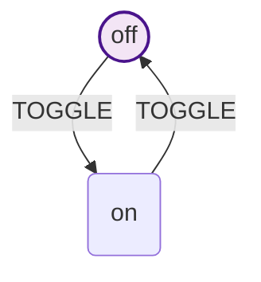

# Visualization Examples

This guide provides practical examples of using HSMJS visualization features in real-world scenarios.

## Basic Examples

### Simple Toggle Switch

Perfect for understanding basic visualization concepts:

```javascript
import { createMachine } from '@datnguyen1215/hsmjs'

const machine = createMachine('toggle-switch')

const off = machine.state('off')
const on = machine.state('on')

off.on('TOGGLE', 'on')
on.on('TOGGLE', 'off')
machine.initial(off)

// Generate and preview
const visualizer = machine.visualizer()
const diagram = visualizer.visualize()
await visualizer.preview()
```

**Generated Diagram:**


### Traffic Light System

Shows state transitions with timing:

```javascript
const machine = createMachine('traffic-light')

const red = machine.state('red')
const yellow = machine.state('yellow')
const green = machine.state('green')

red.on('TIMER', 'green')
green.on('TIMER', 'yellow')
yellow.on('TIMER', 'red')

machine.initial(red)

// Preview with current state tracking
const instance = machine.start()
const diagram = instance.visualizer().visualize()
console.log(diagram) // Shows red as current

await instance.send('TIMER')
// Save diagram to file using Node.js fs module
const diagram = instance.visualizer().visualize()
fs.writeFileSync('traffic-green.html', diagram) // Shows green
```

## Hierarchical Examples

### Media Player States

Demonstrates nested state visualization:

```javascript
const machine = createMachine('media-player')

// Top-level states
const stopped = machine.state('stopped')
const playing = machine.state('playing')
const paused = machine.state('paused')

// Nested playback modes
const normal = playing.state('normal')
const fastForward = playing.state('fast-forward')
const rewind = playing.state('rewind')

// Nested pause modes
const shortPause = paused.state('short-pause')
const longPause = paused.state('long-pause')

// Set initial states
machine.initial(stopped)
playing.initial(normal)
paused.initial(shortPause)

// Transitions
stopped.on('PLAY', 'normal')
normal.on('FF', 'fast-forward').on('REWIND', 'rewind').on('PAUSE', 'short-pause')
fastForward.on('NORMAL', 'normal').on('PAUSE', 'short-pause')
rewind.on('NORMAL', 'normal').on('PAUSE', 'short-pause')
shortPause.on('RESUME', 'normal').on('LONG_PAUSE', 'long-pause')
longPause.on('RESUME', 'normal')
playing.on('STOP', 'stopped')
paused.on('STOP', 'stopped')

const diagram = machine.visualizer().visualize()
console.log(diagram)
```

**Key Features Shown:**
- Multiple levels of nesting
- Initial states at each level
- Cross-hierarchy transitions
- Proper subgraph organization

### Authentication Flow

Complex business logic visualization:

```javascript
const machine = createMachine('authentication-system')

// Level 1: Main authentication states
const unauthenticated = machine.state('unauthenticated')
const authenticated = machine.state('authenticated')
const suspended = machine.state('suspended')

// Level 2: Unauthenticated substates
const login = unauthenticated.state('login')
const register = unauthenticated.state('register')
const forgotPassword = unauthenticated.state('forgot-password')

// Level 2: Authenticated substates
const dashboard = authenticated.state('dashboard')
const profile = authenticated.state('profile')
const settings = authenticated.state('settings')

// Level 3: Settings substates
const account = settings.state('account')
const privacy = settings.state('privacy')
const security = settings.state('security')

// Level 3: Profile substates
const viewing = profile.state('viewing')
const editing = profile.state('editing')

// Set initial states
machine.initial(unauthenticated)
unauthenticated.initial(login)
authenticated.initial(dashboard)
settings.initial(account)
profile.initial(viewing)

// Cross-level transitions
login.on('LOGIN_SUCCESS', 'dashboard')
register.on('REGISTER_SUCCESS', 'dashboard')
forgotPassword.on('RESET_SUCCESS', 'login')

// Within-level transitions
login.on('REGISTER', 'register').on('FORGOT_PASSWORD', 'forgot-password')
register.on('BACK_TO_LOGIN', 'login')
forgotPassword.on('BACK_TO_LOGIN', 'login')

dashboard.on('VIEW_PROFILE', 'viewing').on('SETTINGS', 'account')
viewing.on('EDIT', 'editing').on('DASHBOARD', 'dashboard')
editing.on('SAVE', 'viewing').on('CANCEL', 'viewing')

account.on('PRIVACY', 'privacy').on('SECURITY', 'security')
privacy.on('ACCOUNT', 'account')
security.on('ACCOUNT', 'account')

// Global transitions
authenticated.on('LOGOUT', 'login')
machine.on('SUSPEND_ACCOUNT', 'suspended')
suspended.on('REACTIVATE', 'login')

// Generate documentation
// Save diagram to file using Node.js fs module
const diagram = machine.visualizer().visualize()
fs.writeFileSync('auth-flow-documentation.html', diagram)
```

## Real-World Application Examples

### E-commerce Checkout Process

Complete checkout flow with error handling:

```javascript
const machine = createMachine('ecommerce-checkout')

// Main flow states
const cart = machine.state('cart')
const checkout = machine.state('checkout')
const payment = machine.state('payment')
const confirmation = machine.state('confirmation')
const completed = machine.state('completed')

// Checkout substates
const shipping = checkout.state('shipping')
const billing = checkout.state('billing')
const review = checkout.state('review')

// Payment substates
const processing = payment.state('processing')
const approved = payment.state('approved')
const declined = payment.state('declined')
const retry = payment.state('retry')

// Error handling states
const error = machine.state('error')
const networkError = error.state('network-error')
const validationError = error.state('validation-error')
const paymentError = error.state('payment-error')

// Initialize
machine.initial(cart)
checkout.initial(shipping)
payment.initial(processing)
error.initial(networkError)

// Main flow
cart.on('CHECKOUT', 'shipping')
shipping.on('CONTINUE', 'billing')
billing.on('CONTINUE', 'review')
review.on('SUBMIT_ORDER', 'processing')
processing.on('APPROVED', 'approved')
approved.on('CONFIRM', 'confirmation')
confirmation.on('COMPLETE', 'completed')

// Error flows
processing.on('DECLINED', 'declined')
declined.on('RETRY', 'retry')
retry.on('SUBMIT', 'processing')

// Global error handling
machine.on('NETWORK_ERROR', 'network-error')
machine.on('VALIDATION_ERROR', 'validation-error')
machine.on('PAYMENT_ERROR', 'payment-error')

// Recovery flows
networkError.on('RETRY', ctx => ctx.previousState || 'cart')
validationError.on('FIX', ctx => ctx.previousState || 'cart')
paymentError.on('RETRY', 'processing')

// Track user journey
const instance = machine.start()

// Visualize each step for debugging
instance.subscribe(async ({ to }) => {
  await instance.visualizer().save(`checkout-step-${to.replace(/\./g, '-')}.html`)
})

// Start checkout process
await instance.send('CHECKOUT')
await instance.send('CONTINUE') // shipping -> billing
// Save diagram to file using Node.js fs module
const diagram = instance.visualizer().visualize()
fs.writeFileSync('current-checkout-state.html', diagram)
```

### Task Management System

Project workflow visualization:

```javascript
const machine = createMachine('task-management')

// Main workflow states
const backlog = machine.state('backlog')
const inProgress = machine.state('in-progress')
const review = machine.state('review')
const done = machine.state('done')
const archived = machine.state('archived')

// In-progress substates
const assigned = inProgress.state('assigned')
const active = inProgress.state('active')
const blocked = inProgress.state('blocked')

// Review substates
const codeReview = review.state('code-review')
const qaReview = review.state('qa-review')
const approved = review.state('approved')
const rejected = review.state('rejected')

// Blocked substates
const waitingDependency = blocked.state('waiting-dependency')
const waitingClarification = blocked.state('waiting-clarification')
const waitingResources = blocked.state('waiting-resources')

// Initialize states
machine.initial(backlog)
inProgress.initial(assigned)
review.initial(codeReview)
blocked.initial(waitingDependency)

// Workflow transitions
backlog.on('START_WORK', 'assigned')
assigned.on('BEGIN', 'active')
active.on('SUBMIT_REVIEW', 'code-review')
  .on('BLOCK', 'waiting-dependency')

codeReview.on('APPROVE', 'qa-review')
  .on('REQUEST_CHANGES', 'active')
qaReview.on('APPROVE', 'approved')
  .on('REQUEST_CHANGES', 'active')
approved.on('DEPLOY', 'done')
rejected.on('REWORK', 'active')

// Unblocking flows
waitingDependency.on('DEPENDENCY_READY', 'active')
waitingClarification.on('CLARIFIED', 'active')
waitingResources.on('RESOURCES_AVAILABLE', 'active')

// Administrative transitions
done.on('ARCHIVE', 'archived')
machine.on('CANCEL', 'archived')
archived.on('RESTORE', 'backlog')

// Generate project documentation
// Save diagram to file using Node.js fs module
const diagram = machine.visualizer().visualize()
fs.writeFileSync('task-workflow.html', diagram)

// Track specific task
const taskInstance = machine.start({ taskId: 'TASK-123' })
await taskInstance.send('START_WORK')
await taskInstance.send('BEGIN')

// Save current state for project dashboard
// Save diagram to file using Node.js fs module
const diagram = taskInstance.visualizer().visualize()
fs.writeFileSync('task-123-status.html', diagram)
```

## Development Workflow Examples

### Continuous Integration Pipeline

DevOps pipeline visualization:

```javascript
const machine = createMachine('ci-pipeline')

// Main pipeline stages
const triggered = machine.state('triggered')
const build = machine.state('build')
const test = machine.state('test')
const deploy = machine.state('deploy')
const monitoring = machine.state('monitoring')
const completed = machine.state('completed')

// Build substates
const installing = build.state('installing-dependencies')
const compiling = build.state('compiling')
const packaging = build.state('packaging')

// Test substates
const unitTests = test.state('unit-tests')
const integrationTests = test.state('integration-tests')
const e2eTests = test.state('e2e-tests')

// Deploy substates
const staging = deploy.state('staging')
const production = deploy.state('production')

// Failure states
const failed = machine.state('failed')
const buildFailed = failed.state('build-failed')
const testFailed = failed.state('test-failed')
const deployFailed = failed.state('deploy-failed')

// Initialize
machine.initial(triggered)
build.initial(installing)
test.initial(unitTests)
deploy.initial(staging)
failed.initial(buildFailed)

// Success flow
triggered.on('START_BUILD', 'installing-dependencies')
installing.on('SUCCESS', 'compiling')
compiling.on('SUCCESS', 'packaging')
packaging.on('SUCCESS', 'unit-tests')
unitTests.on('SUCCESS', 'integration-tests')
integrationTests.on('SUCCESS', 'e2e-tests')
e2eTests.on('SUCCESS', 'staging')
staging.on('SUCCESS', 'production')
production.on('SUCCESS', 'monitoring')
monitoring.on('STABLE', 'completed')

// Failure flows
installing.on('FAILURE', 'build-failed')
compiling.on('FAILURE', 'build-failed')
packaging.on('FAILURE', 'build-failed')
unitTests.on('FAILURE', 'test-failed')
integrationTests.on('FAILURE', 'test-failed')
e2eTests.on('FAILURE', 'test-failed')
staging.on('FAILURE', 'deploy-failed')
production.on('FAILURE', 'deploy-failed')

// Recovery flows
buildFailed.on('RETRY', 'installing-dependencies')
testFailed.on('RETRY', 'unit-tests')
deployFailed.on('RETRY', 'staging')

// Manual interventions
machine.on('ABORT', 'failed')
failed.on('RESET', 'triggered')

// Generate CI/CD documentation
// Save diagram to file using Node.js fs module
const diagram = machine.visualizer().visualize()
fs.writeFileSync('cicd-pipeline.html', diagram)
```

## Debugging and Monitoring Examples

### Real-time State Tracking

Monitor state changes during development:

```javascript
const machine = createMachine('user-onboarding')

// Onboarding states...
const welcome = machine.state('welcome')
const profile = machine.state('profile-setup')
const preferences = machine.state('preferences')
const tutorial = machine.state('tutorial')
const completed = machine.state('completed')

// Setup transitions...
welcome.on('START', 'profile-setup')
profile.on('CONTINUE', 'preferences')
preferences.on('CONTINUE', 'tutorial')
tutorial.on('FINISH', 'completed')

machine.initial(welcome)

// Create monitoring instance
const instance = machine.start({ userId: 'user123' })

// Real-time visualization updates
instance.subscribe(async ({ from, to, event }) => {
  console.log(`State change: ${from} → ${to} (${event})`)

  // Save snapshot for each state change
  const timestamp = new Date().toISOString().replace(/[:.]/g, '-')
  await instance.visualizer().save(`onboarding-${timestamp}.html`)
})

// Error tracking with visualization
try {
  await instance.send('START')
  await instance.send('CONTINUE')
  await instance.send('CONTINUE')
  await instance.send('FINISH')
} catch (error) {
  console.error('Onboarding failed:', error)
  // Save diagram to file using Node.js fs module
const diagram = instance.visualizer().visualize()
fs.writeFileSync('onboarding-error-state.html', diagram)
}
```

### A/B Testing Visualization

Compare different user flows:

```javascript
// Version A - Simple flow
const machineA = createMachine('checkout-flow-a')
const cartA = machineA.state('cart')
const checkoutA = machineA.state('checkout')
const paymentA = machineA.state('payment')
const completeA = machineA.state('complete')

cartA.on('CHECKOUT', 'checkout')
checkoutA.on('PAY', 'payment')
paymentA.on('SUCCESS', 'complete')
machineA.initial(cartA)

// Version B - Enhanced flow
const machineB = createMachine('checkout-flow-b')
const cartB = machineB.state('cart')
const reviewB = machineB.state('review')
const checkoutB = machineB.state('checkout')
const paymentB = machineB.state('payment')
const confirmationB = machineB.state('confirmation')
const completeB = machineB.state('complete')

cartB.on('REVIEW', 'review')
reviewB.on('CHECKOUT', 'checkout')
checkoutB.on('PAY', 'payment')
paymentB.on('SUCCESS', 'confirmation')
confirmationB.on('CONFIRM', 'complete')
machineB.initial(cartB)

// Generate comparison documentation
// Save diagram to file using Node.js fs module
const diagram = machineA.visualizer().visualize()
fs.writeFileSync('checkout-flow-a.html', diagram)
// Save diagram to file using Node.js fs module
const diagram = machineB.visualizer().visualize()
fs.writeFileSync('checkout-flow-b.html', diagram)

// Track conversion rates
const instanceA = machineA.start({ variant: 'A' })
const instanceB = machineB.start({ variant: 'B' })

// ... run A/B test and save results with state visualizations
```

## Documentation Generation

### API Documentation Integration

Generate state diagrams for API documentation:

```javascript
// Generate markdown documentation with embedded diagrams
const machine = createMachine('api-request-lifecycle')

const idle = machine.state('idle')
const pending = machine.state('pending')
const success = machine.state('success')
const error = machine.state('error')
const retrying = machine.state('retrying')

idle.on('REQUEST', 'pending')
pending.on('SUCCESS', 'success').on('ERROR', 'error')
error.on('RETRY', 'retrying')
retrying.on('REQUEST', 'pending').on('GIVE_UP', 'error')
success.on('RESET', 'idle')
error.on('RESET', 'idle')

machine.initial(idle)

// Save as Mermaid for documentation
// Save diagram to file using Node.js fs module
const diagram = machine.visualizer().visualize()
fs.writeFileSync('api-request-lifecycle.mmd', diagram)

// Create documentation template
const documentation = `
# API Request Lifecycle

This document describes the state machine that manages API request lifecycles.

## State Diagram

\`\`\`mermaid
${machine.visualizer().visualize()}
\`\`\`

## States

- **idle**: No active requests
- **pending**: Request in progress
- **success**: Request completed successfully
- **error**: Request failed
- **retrying**: Attempting to retry failed request

## Usage Example

\`\`\`javascript
const api = machine.start()
await api.send('REQUEST')
// Handle success/error states
\`\`\`
`

// Save complete documentation
require('fs').writeFileSync('API_LIFECYCLE.md', documentation)
```

### Team Onboarding

Create visual guides for new team members:

```javascript
const machine = createMachine('development-workflow')

// Developer workflow states with detailed substates
// ... (detailed state machine definition)

// Generate onboarding materials
// Save diagram to file using Node.js fs module
const diagram = machine.visualizer().visualize()
fs.writeFileSync('development-workflow-guide.html', diagram)

// Create interactive tutorials
const tutorialInstance = machine.start({ developer: 'new-hire' })
// ... guided walkthrough with state visualization at each step
```

## Best Practices

### Performance Monitoring

Track visualization generation performance:

```javascript
console.time('visualization-generation')
const visualizer = largeMachine.visualizer()
const diagram = visualizer.visualize()
console.timeEnd('visualization-generation')

console.time('preview-generation')
const diagram = largeMachine.visualizer().visualize()
console.log(diagram)
console.timeEnd('preview-generation')
```

### Automated Documentation

Set up automatic diagram generation in your build process:

```javascript
// scripts/generate-diagrams.js
const machines = require('./state-machines')

async function generateDiagrams() {
  for (const [name, machine] of Object.entries(machines)) {
    await machine.visualizer().save(`docs/diagrams/${name}.html`)
    await machine.visualizer().save(`docs/diagrams/${name}.mmd`)
  }
}

generateDiagrams().catch(console.error)
```

### Version Control Integration

Include state diagrams in pull requests:

```bash
# Pre-commit hook to generate diagrams
npm run generate-diagrams
git add docs/diagrams/
```

These examples demonstrate the power and flexibility of HSMJS visualization capabilities across different use cases, from simple debugging to comprehensive documentation generation.