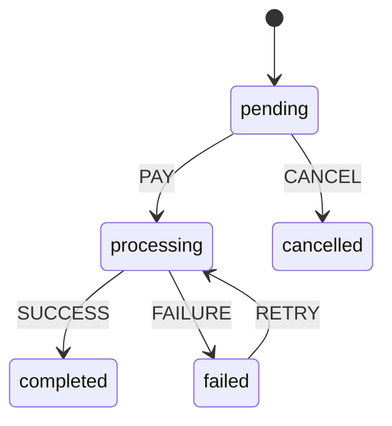
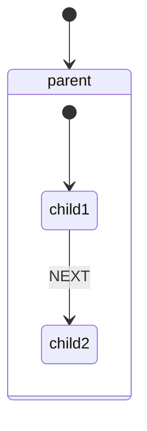
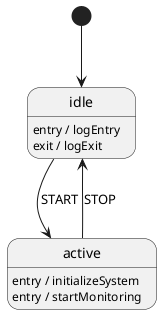

# Visualization

## Syntax Quick Reference

```javascript
// Generate Mermaid diagram (default)
const diagram = machine.visualize();

// Specify direction
const horizontal = machine.visualize({ direction: 'LR' });

// Generate PlantUML diagram
const plantUml = machine.visualize({ type: 'plantuml' });

// Direction options: 'TB', 'LR', 'BT', 'RL'
// Type options: 'mermaid', 'plantuml'
```

## Basic Usage

Generate state diagrams from your machine:

```javascript
import { createMachine } from '@datnguyen1215/hsmjs';

const machine = createMachine({
  id: 'order',
  initial: 'pending',
  states: {
    pending: {
      on: {
        PAY: 'processing',
        CANCEL: 'cancelled'
      }
    },
    processing: {
      on: {
        SUCCESS: 'completed',
        FAILURE: 'failed'
      }
    },
    completed: {},
    failed: {
      on: { RETRY: 'processing' }
    },
    cancelled: {}
  }
});

// Generate diagram
const diagram = machine.visualize();
console.log(diagram);
```

Output:


## Mermaid Diagrams

### Basic Mermaid Generation

Default visualization format:

```javascript
const mermaidDiagram = machine.visualize();
// or explicitly
const mermaidDiagram = machine.visualize({ type: 'mermaid' });
```

### Direction Control

Control diagram flow direction:

```javascript
// Top to Bottom (default)
machine.visualize({ direction: 'TB' });

// Left to Right (good for wide machines)
machine.visualize({ direction: 'LR' });

// Bottom to Top
machine.visualize({ direction: 'BT' });

// Right to Left
machine.visualize({ direction: 'RL' });
```

### Mermaid with Guards

Guards are automatically displayed:

```javascript
const guardMachine = createMachine({
  states: {
    idle: {
      on: {
        SUBMIT: [
          {
            target: 'success',
            cond: ({ context }) => context.isValid
          },
          {
            target: 'error'
          }
        ]
      }
    }
  }
});

const diagram = guardMachine.visualize();
// Shows: idle --> success : SUBMIT [guard]
//        idle --> error : SUBMIT
```

### Nested States in Mermaid

Hierarchical states are properly formatted:

```javascript
const nestedMachine = createMachine({
  initial: 'parent',
  states: {
    parent: {
      initial: 'child1',
      states: {
        child1: {
          on: { NEXT: 'child2' }
        },
        child2: {}
      }
    }
  }
});

const diagram = nestedMachine.visualize();
```

Output:


## PlantUML Diagrams

### Why Choose PlantUML

PlantUML excels when states have entry/exit actions:

```javascript
const actionMachine = createMachine({
  states: {
    idle: {
      entry: 'logEntry',
      exit: 'logExit',
      on: { START: 'active' }
    },
    active: {
      entry: ['initializeSystem', 'startMonitoring'],
      on: { STOP: 'idle' }
    }
  }
});

const plantUml = actionMachine.visualize({ type: 'plantuml' });
```

Output shows actions inside state boxes:


### PlantUML Syntax

```javascript
// Generate PlantUML
const plantUmlDiagram = machine.visualize({ type: 'plantuml' });

// PlantUML doesn't support direction parameter
// Direction is controlled in PlantUML renderer
```

### PlantUML Features

Entry/exit actions displayed inline:

```javascript
const machine = createMachine({
  states: {
    loading: {
      entry: 'showSpinner',
      exit: 'hideSpinner',
      on: {
        SUCCESS: 'ready',
        ERROR: 'failed'
      }
    },
    ready: {
      entry: 'initializeApp'
    },
    failed: {
      entry: 'showError',
      exit: 'clearError'
    }
  }
});

const diagram = machine.visualize({ type: 'plantuml' });
// Actions appear as annotations within state boxes
```

## Rendering Diagrams

### Mermaid Rendering Options

1. **Mermaid Live Editor**
   - Visit: https://mermaid.live
   - Paste diagram code
   - Instant preview and export

2. **GitHub/GitLab Markdown**
   ````markdown
   ```mermaid
   stateDiagram-v2
       [*] --> idle
       idle --> active : START
   ```
   ````

3. **VS Code Extensions**
   - Install: "Markdown Preview Mermaid Support"
   - Preview in editor

4. **Documentation Sites**
   - Docsify, Docusaurus, MkDocs
   - Most support Mermaid natively

### PlantUML Rendering Options

1. **PlantUML Online Server**
   - Visit: http://www.plantuml.com/plantuml
   - Paste diagram code
   - Generate image/SVG

2. **VS Code Extensions**
   - Install: "PlantUML"
   - Preview with Alt+D

3. **Local PlantUML Server**
   ```bash
   docker run -d -p 8080:8080 plantuml/plantuml-server
   ```

4. **Integration in Docs**
   - Many tools support PlantUML
   - Can generate images at build time

## Complex Visualizations

### Machine with Guards and Actions

```javascript
const complexMachine = createMachine({
  id: 'auth',
  initial: 'idle',
  states: {
    idle: {
      on: {
        LOGIN: [
          {
            target: 'authenticated',
            cond: 'isValidUser',
            actions: 'setUser'
          },
          {
            target: 'error',
            actions: 'logError'
          }
        ]
      }
    },
    authenticated: {
      entry: 'notifySuccess',
      initial: 'dashboard',
      states: {
        dashboard: {
          on: { VIEW_PROFILE: 'profile' }
        },
        profile: {
          on: { BACK: 'dashboard' }
        }
      },
      on: {
        LOGOUT: {
          target: 'idle',
          actions: 'clearSession'
        }
      }
    },
    error: {
      entry: 'displayError',
      on: { RETRY: 'idle' }
    }
  }
});

// Mermaid shows structure and guards
const mermaid = complexMachine.visualize();

// PlantUML shows structure and actions
const plantUml = complexMachine.visualize({ type: 'plantuml' });
```

### Excluding Elements

Wildcard events are automatically excluded:

```javascript
const machine = createMachine({
  states: {
    idle: {
      on: {
        START: 'active',
        STOP: 'idle',
        '*': {  // Not shown in diagram
          actions: 'logUnknownEvent'
        }
      }
    }
  }
});

// Wildcard handlers omitted for clarity
const diagram = machine.visualize();
```

## Visualization Use Cases

### Documentation

Generate diagrams for README files:

```javascript
// In your build script
const fs = require('fs');
const { createMachine } = require('@datnguyen1215/hsmjs');

const machine = createMachine(config);
const diagram = machine.visualize();

fs.writeFileSync('docs/state-diagram.md', `
## State Diagram

\`\`\`mermaid
${diagram}
\`\`\`
`);
```

### Debugging

Visualize to understand flow:

```javascript
// During development
console.log('Current state:', machine.state);
console.log('Machine structure:');
console.log(machine.visualize({ direction: 'LR' }));
```

### Testing

Verify machine structure:

```javascript
test('machine has expected structure', () => {
  const diagram = machine.visualize();

  // Check for expected states
  expect(diagram).toContain('idle');
  expect(diagram).toContain('active');

  // Check for transitions
  expect(diagram).toContain('idle --> active : START');
});
```

## Comparison: Mermaid vs PlantUML

| Feature | Mermaid | PlantUML |
|---------|---------|----------|
| **GitHub Support** | ✅ Native | ❌ Needs rendering |
| **Entry/Exit Actions** | ❌ Not shown | ✅ Inline display |
| **Direction Control** | ✅ In API | ❌ In renderer |
| **Browser Rendering** | ✅ JavaScript | ❌ Needs server |
| **Nested States** | ✅ Good | ✅ Excellent |
| **File Size** | Small | Small |
| **Learning Curve** | Easy | Easy |

### When to Use Mermaid
- GitHub/GitLab documentation
- Quick previews in markdown
- Client-side rendering needed
- Simple state machines

### When to Use PlantUML
- Complex machines with many actions
- Need to show entry/exit behaviors
- Generating static documentation
- Enterprise documentation tools

## Common Pitfalls

### ❌ Expecting Runtime Updates

```javascript
// Wrong - diagram is static snapshot
const diagram = machine.visualize();
machine.send('EVENT');
// diagram doesn't change

// Generate new diagram after changes
const newDiagram = machine.visualize();
```

### ❌ Including Dynamic Data

```javascript
// Context values not shown in diagrams
context: {
  count: 5  // Not visible in visualization
}

// Diagrams show structure, not runtime data
```

### ❌ Manual Diagram Editing

```javascript
// Don't edit generated diagrams
const diagram = machine.visualize();
// Modifying the string won't affect the machine
```

## Best Practices

1. **Generate diagrams in CI/CD** for documentation
2. **Use direction wisely** - LR for wide, TB for deep
3. **Choose format based on needs** - Mermaid for web, PlantUML for actions
4. **Keep machines visualizable** - avoid overly complex structures
5. **Use for onboarding** - help new developers understand flow
6. **Version control diagrams** - track structure changes
7. **Validate with visualization** - ensure machine matches intent