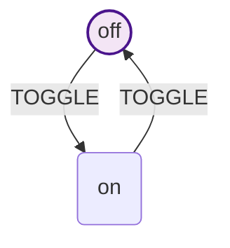
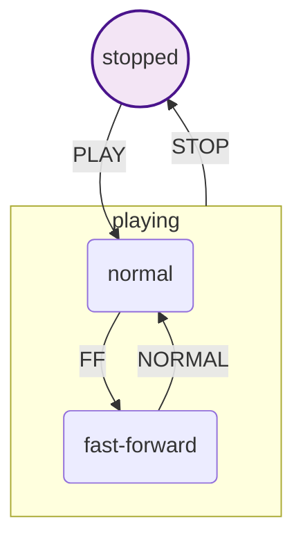
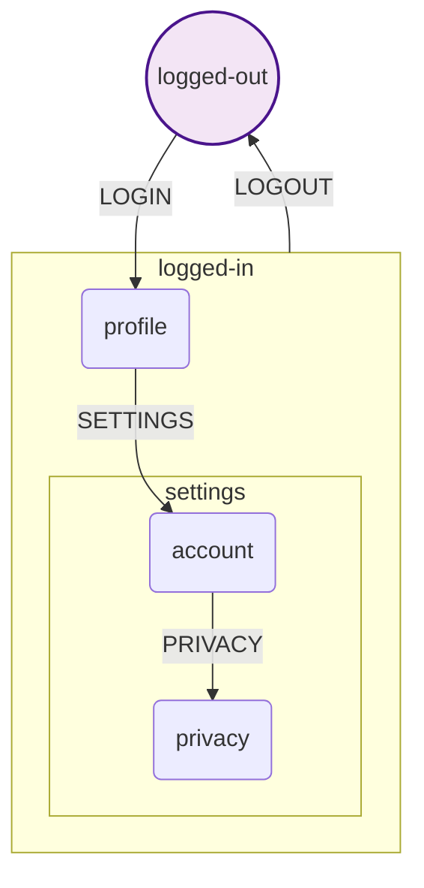

# State Machine Visualization

The HSMJS library includes built-in visualization capabilities that generate Mermaid diagrams of your state machines. This helps developers understand complex state structures, debug state transitions, and document system behavior.

## Features

- 🎨 **Automatic Diagram Generation** - Convert any state machine to Mermaid syntax
- 🏗️ **Hierarchical State Support** - Properly visualizes nested states using subgraphs
- 🔍 **Current State Highlighting** - Shows the active state in running instances
- 🌐 **Browser Preview** - Opens generated diagrams in your default browser
- 💾 **File Export** - Save diagrams to disk with auto-format detection
- 🔧 **Zero Configuration** - Works out of the box with no setup required

## Quick Start

### Basic Visualization

```javascript
import { createMachine } from '@datnguyen1215/hsmjs'

const machine = createMachine('toggle')

// Define states
machine.state('off')
machine.state('on')

// Define transitions with string references
machine.state('off').on('TOGGLE', 'on')
machine.state('on').on('TOGGLE', 'off')
machine.initial('off')

// Generate Mermaid diagram
const visualizer = machine.visualizer()
const diagram = visualizer.visualize()
console.log(diagram)
```

**Output:**


### Browser Preview

```javascript
// Open diagram in browser for immediate visualization
await machine.visualizer().preview()
```

### Save to File

```javascript
// Save as HTML file (auto-detected from extension)
await machine.visualizer().save('my-state-machine.html')

// Save as Mermaid text file
await machine.visualizer().save('my-state-machine.mmd')
```

## API Reference

### Machine Methods

#### `machine.visualizer().visualize()`

Generates a Mermaid diagram string representing the state machine structure.

**Returns:** `string` - Mermaid diagram syntax

**Example:**
```javascript
const visualizer = machine.visualizer()
const diagram = visualizer.visualize()
// Returns: "graph TD\n  state1(("state1"))\n..."
```

#### `machine.visualizer()`

Returns a visualizer object with preview and save methods.

**Returns:** `object` - Visualizer interface

**Methods:**
- `preview()` - Opens diagram in browser
- `save(filename)` - Saves diagram to file

**Example:**
```javascript
const viz = machine.visualizer()

// Preview in browser
await viz.preview()

// Save to file
await viz.save('diagram.html')
```

### Instance Methods

#### `instance.visualizer().visualize()`

Generates a Mermaid diagram with current state highlighting for running instances.

**Returns:** `string` - Mermaid diagram with current state styling

**Example:**
```javascript
const instance = machine.start()
await instance.send('TOGGLE')

const visualizer = instance.visualizer()
const diagram = visualizer.visualize()
// Shows current state with blue highlighting
```

#### `instance.visualizer()`

Returns a visualizer object for the instance with current state context.

**Returns:** `object` - Instance visualizer interface

## Hierarchical States

The visualizer automatically handles nested states using Mermaid subgraphs:

```javascript
const machine = createMachine('media-player')

// Parent states
const stopped = machine.state('stopped')
const playing = machine.state('playing')

// Child states
const normal = playing.state('normal')
const fastForward = playing.state('fast-forward')

// Set initial states
playing.initial('normal')
machine.initial('stopped')

// Transitions
stopped.on('PLAY', 'playing.normal')
normal.on('FF', 'fast-forward')
fastForward.on('NORMAL', 'normal')
playing.on('STOP', 'stopped')

const visualizer = machine.visualizer()
const diagram = visualizer.visualize()
```

**Generated Diagram:**


## Multi-Level Nesting

The visualizer supports unlimited nesting depth:

```javascript
const machine = createMachine('authentication')

const loggedOut = machine.state('logged-out')
const loggedIn = machine.state('logged-in')

// Second level
const profile = loggedIn.state('profile')
const settings = loggedIn.state('settings')

// Third level
const account = settings.state('account')
const privacy = settings.state('privacy')

// Set initial states
settings.initial('account')
loggedIn.initial('profile')
machine.initial('logged-out')

// Transitions
loggedOut.on('LOGIN', 'logged-in.profile')
profile.on('SETTINGS', 'settings.account')
account.on('PRIVACY', 'privacy')
loggedIn.on('LOGOUT', 'logged-out')
```

**Generated Structure:**


## Current State Highlighting

When visualizing running instances, the current state is highlighted with special styling:

```javascript
const instance = machine.start()
await instance.send('LOGIN')

const visualizer = instance.visualizer()
const diagram = visualizer.visualize()
// The current state gets blue highlighting:
// class logged_in_profile current
// classDef current fill:#e1f5fe,stroke:#01579b,stroke-width:3px
```

## File Formats

### HTML Export

When saving with `.html` extension, generates a complete HTML page with embedded Mermaid:

```javascript
await machine.visualizer().save('state-machine.html')
```

**Generated HTML includes:**
- Mermaid.js library (CDN)
- Diagram rendering
- Responsive styling
- Metadata and title

### Mermaid Text Export

When saving with `.mmd` or `.md` extension, saves raw Mermaid syntax:

```javascript
await machine.visualizer().save('state-machine.mmd')
```

**Generated file contains:**
```
graph TD
  state1(("state1"))
  state2("state2")
  state1 -->|EVENT| state2
  class state1 initial
  classDef initial fill:#f3e5f5,stroke:#4a148c,stroke-width:2px
```

## Advanced Examples

### E-commerce Order Processing

```javascript
const machine = createMachine('ecommerce-order-processing')

// Level 1: Main flow
const cart = machine.state('cart')
const checkout = machine.state('checkout')
const payment = machine.state('payment')
const fulfillment = machine.state('fulfillment')
const completed = machine.state('completed')

// Level 2: Checkout details
const shipping = checkout.state('shipping')
const billing = checkout.state('billing')
const review = checkout.state('review')

// Level 2: Payment processing
const processing = payment.state('processing')
const approved = payment.state('approved')
const declined = payment.state('declined')

// Level 2: Fulfillment stages
const preparing = fulfillment.state('preparing')
const shipped = fulfillment.state('shipped')
const delivered = fulfillment.state('delivered')

// Set initial states
machine.initial('cart')
checkout.initial('shipping')
payment.initial('processing')
fulfillment.initial('preparing')

// Transitions
cart.on('CHECKOUT', 'checkout.shipping')
shipping.on('NEXT', 'billing')
billing.on('NEXT', 'review')
review.on('SUBMIT', 'payment.processing')

processing.on('APPROVE', 'approved')
processing.on('DECLINE', 'declined')
approved.on('FULFILL', 'fulfillment.preparing')

preparing.on('SHIP', 'shipped')
shipped.on('DELIVER', 'delivered')
delivered.on('COMPLETE', 'completed')

// Visualize the complete flow
const visualizer = machine.visualizer()
const diagram = visualizer.visualize()
```

This generates a comprehensive diagram showing the entire e-commerce order processing flow with proper hierarchical organization.

### Real-time State Tracking

```javascript
const instance = machine.start()

// Subscribe to state changes and update visualization
instance.subscribe(async ({ to }) => {
  console.log(`State changed to: ${to}`)

  // Generate updated visualization with current state
  const visualizer = instance.visualizer()
const diagram = visualizer.visualize()

  // Save snapshot for debugging
  await instance.visualizer().save(`state-${Date.now()}.html`)
})

// Process some events
await instance.send('CHECKOUT')
await instance.send('NEXT')
await instance.send('NEXT')
await instance.send('SUBMIT')
```

## Browser Compatibility

The browser preview feature requires:
- Node.js environment with `fs` and `child_process` modules
- Default browser that supports HTML5 and JavaScript
- Internet connection for Mermaid.js CDN (in HTML exports)

## Troubleshooting

### Common Issues

**Issue:** "Syntax error in text" when viewing Mermaid diagrams

**Solution:** This library generates Mermaid v10.9.3 compatible syntax. Ensure your Mermaid viewer supports the latest syntax.

**Issue:** Browser preview doesn't open

**Solution:** Check that your system has a default browser configured and that Node.js has permission to execute child processes.

**Issue:** Complex state names cause diagram errors

**Solution:** The library automatically sanitizes state IDs by replacing special characters with underscores. The original names are preserved in the display labels.

### Debug Mode

For debugging visualization issues, inspect the generated Mermaid syntax:

```javascript
const visualizer = machine.visualizer()
const diagram = visualizer.visualize()
console.log('Generated Mermaid:')
console.log(diagram)

// Validate syntax at https://mermaid.live
```

## Integration with Development Tools

### VSCode Extension

Install the "Mermaid Markdown Syntax Highlighting" extension to view saved `.mmd` files with syntax highlighting.

### Documentation Generation

Include state machine visualizations in your project documentation:

```markdown
## System Architecture

The authentication flow follows this state machine:


```

### Testing and Validation

Use visualizations to validate state machine logic:

```javascript
// In your tests
test('authentication flow structure', () => {
  const visualizer = authMachine.visualizer()
const diagram = visualizer.visualize()

  // Verify key states are present
  expect(diagram).toContain('logged_out')
  expect(diagram).toContain('logged_in')

  // Verify critical transitions
  expect(diagram).toContain('logged_out -->|LOGIN|')
  expect(diagram).toContain('logged_in -->|LOGOUT|')
})
```

## Best Practices

### Naming Conventions

- Use descriptive state names that read well in diagrams
- Avoid special characters that might affect Mermaid syntax
- Keep state names concise but meaningful

### Hierarchical Organization

- Group related states under common parents
- Limit nesting depth to 3-4 levels for readability
- Use consistent naming patterns within state groups

### Documentation Workflow

1. Design state machine structure
2. Generate visualization early in development
3. Use diagrams in code reviews and documentation
4. Update visualizations as the system evolves
5. Include state diagrams in project documentation

## Performance Notes

- Visualization generation is lightweight and runs in milliseconds
- Large state machines (100+ states) may produce complex diagrams
- Browser rendering performance depends on diagram complexity
- File exports are immediate with minimal overhead

The visualization system is designed to scale with your state machine complexity while maintaining excellent performance and clear visual representation.